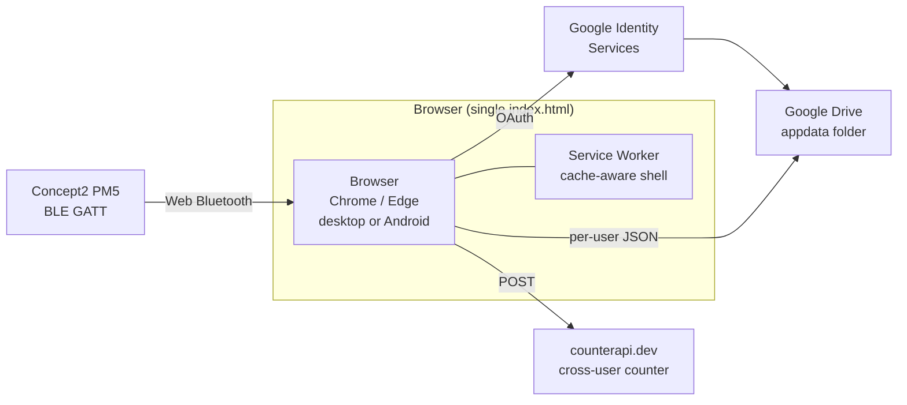

<div align="center">


# PM5 Dashboard

**Real-time Bluetooth dashboard for the Concept2 PM5 — built by a rower, for rowers.**

[](LICENSE)


**Live demo:**
[pm5row.surge.sh](https://pm5row.surge.sh) · [rowerg-dashboard.surge.sh](https://rowerg-dashboard.surge.sh) · [ergdash.surge.sh](https://ergdash.surge.sh)

</div>

> Open in Chrome or Edge on a desktop or Android phone. Click **Connect**, pair the PM5 over Bluetooth, and row.

---

## What it does

| | |
|---|---|
| **Live force curve** | Reads the raw force-vs-position curve from the PM5 every stroke, draws it smoothed in real time, and overlays your **best stroke** and **session average** as ghost curves. Peak-force markers show where in the drive the peak occurs — early peak vs late peak is the most actionable technique signal you can give a rower. |
| **45 live metrics** | Stroke rate, pace, watts, distance, peak force, avg force, work/stroke, drive length, drive ratio, slip (catch/release), peak force timing, meters/stroke, drag factor, calories, splits, and 18 HR-specific metrics (current zone, % max, % HRR, time-in-zone, drift, decoupling, recovery deltas, TRIMP load). |
| **Tier-based layouts + 6 focus presets** | Cards size themselves by importance tier (primary / secondary / passive). Six curated presets — Balanced, Technical, Power, Heart Rate, Endurance, Race — rewrite the entire screen in one tap. Race mode pins **split** as a 168 px primary; Heart Rate mode swaps the force curve out for HR-zone-driven metrics. Each preset enforces **locked metrics** that can't be removed without breaking the mode. |
| **Workout builder + benchmark tests** | Build interval workouts (1 min · 500 m · 1k · 2k · 5k · 6k · 10k · 30 min · 1 hour · half & full marathon). One-tap tests for the standard distances pre-fill the right interval structure (e.g. 2k → 8×250 m, no rest). Plans sync across devices. |
| **Demo Mode** *(v1.2)* | Don't have a PM5? Open Settings → DEMO MODE → **Start Demo Mode** and the dashboard runs against synthetic stroke data — force curve, pace, watts, HR all move realistically. Drive sync auto-pauses so demo workouts never leak into your real history. Lets coaches and visitors explore every screen before practice. |
| **Auto-save recovery** *(v1.2)* | In-flight session totals snapshot to localStorage every 5 seconds. If the browser crashes or the tab is killed mid-row, the next page load prompts to recover the session as a `RECOVERED`-tagged history entry. |
| **CSV / JSON export** *(v1.2)* | Whole-history CSV dump or per-session interval CSV from the Summary modal. Export the raw JSON for downstream analysis in Python or Excel. |
| **Session notes, rating, tags** *(v1.2)* | Every saved workout gets a notes editor — 1–10 rating, free-text notes, comma-separated tags (e.g. `test, steady-state, technical`). Saved with the rest of Drive-synced state so context follows you across devices. |
| **PWA + Drive sync** | Installable on Android (and desktop) with an offline-capable service worker. Google Drive `appdata` scope syncs your workout history, saved plans, layout, HR prefs, **and session notes** across every device you sign into. |
| **Cross-user counter** | A global workout counter ticks every time anyone, anywhere, logs a session. |

---

## Screenshots

### Home menu

> Three-column grid of action cards. The active Drive sync session and global workout counter sit at the bottom.


### Focus preset picker

> Six curated layouts. The primary (defining) metrics are pinned with a coloured pill; each preset has its own accent. Tapping one rewrites the whole on-screen layout and applies a body-class theme.


### Workout builder

> Programmable intervals — distance or time, with rest, with a duplicate button and an optional time cap. Saving stores the plan in your library and syncs it to Drive.


### Saved workouts library

> Every plan you've built. Click **Use →** to activate, **Edit** to modify, ✕ to delete.


### Settings — layout, theme, HR, force-curve overlays

> Per-area card slots (left column, right column, bottom strip). Each slot picks any of the 45 metrics. Theme picker, FC overlay toggles, and HR prefs all live here.


### Benchmarks — personal records + one-tap tests

> Inside Settings. Each row is a standard rowing distance or time-trial; the **TEST** button spawns the right interval workout (2k → 8×250 m, 5k → 10×500 m, etc.) and drops you into the monitor view.


### Demo Mode *(v1.2)* — explore without a PM5

> Also inside Settings. Runs the full dashboard against synthetic stroke data so coaches and visitors can explore every screen before pairing real hardware. Drive sync pauses while active so demo workouts never leak into your real history.


---

## By the numbers

|                                  |               |
|----------------------------------|---------------|
| Lines of code                    | **9,660**     |
| Shipped bundle                   | **360 KB**    |
| Live metrics                     | **45**        |
| Of those, heart-rate metrics     | **18**        |
| Focus presets                    | **6**         |
| Supported boat classes (lineup builder) | **8**  |
| Force-curve resample resolution  | **64 samples**|
| Updates per stroke               | every PM5 BLE notification (~20 Hz peak) |
| Render time (mid-tier hardware)  | < 10 ms       |
| Offline-capable                  | yes (after first load) |
| Crash-resistant                  | yes (auto-save recovery every 5 s) |
| Tagged releases                  | **3** (v1.0.0, v1.1.0, v1.2.0/v1.2.1) |
| Total commits to date            | see [activity](https://github.com/cbikkula/pm5-dashboard/commits/main) |
| External backend                 | **none**      |

---

## Architecture (TL;DR)



The full deep-dive lives in [`docs/architecture.md`](docs/architecture.md) — state model, BLE pipeline, force-curve resampling, layout engine, focus presets, auth + Drive flow, service worker strategy, PWA vs TWA vs native tradeoffs.

For the BLE byte-layouts I reverse-engineered against the Concept2 spec (and the off-by-3 bug I shipped first), see [`docs/ble-protocol.md`](docs/ble-protocol.md).

---

## Tech stack

**Web (`pm5web/`)**
- Vanilla HTML / CSS / JavaScript (no framework, no bundler, no build step)
- Web Bluetooth API
- Google Identity Services + Google Drive API (`drive.appdata` scope)
- Service Worker (PWA install + offline shell)
- Surge.sh hosting (free static)

**Desktop (`pm5dashboard/`)** — original prototype
- Python 3.11+, PySide6 (Qt), bleak (BLE), pyqtgraph (real-time plots), qasync (asyncio + Qt loop), PyInstaller (single-exe)

---

## Running it

### Web (recommended)

Open one of the live URLs in Chrome or Edge:

- https://pm5row.surge.sh
- https://rowerg-dashboard.surge.sh
- https://ergdash.surge.sh

Click **Connect**, pair your PM5, and row. On Android Chrome, tap the menu → **Install app** to add it to your home screen as a PWA.

### Desktop (Python original)

```bash
cd pm5dashboard
pip install -r requirements.txt
python pm5dashboard.py
```

Or build a single-file `.exe` with PyInstaller (Windows): `build_exe.bat`.

---

## Project repo

```
pm5-dashboard/
├── pm5web/                  ← The web app (deployed)
├── pm5dashboard/            ← Original Python desktop app
└── docs/
    ├── architecture.md      ← Deep dive on system design
    ├── ble-protocol.md      ← BLE byte-layout notes
    ├── reflection.md        ← What I learned + would do differently
    ├── testing.md           ← Browsers / devices / firmware tested
    ├── timeline.md          ← Development timeline
    ├── faq.md               ← Mac? iOS? ErgData? Privacy?
    ├── known-issues.md      ← Open bugs / browser limitations
    ├── logo.svg             ← Vector logo
    └── screenshots/         ← In-app captures
```

---

## Coming soon

The roadmap is tracked in [`docs/feature-backlog.md`](docs/feature-backlog.md) so nothing gets forgotten. **24 short-cycle items** (one focused session each) plus **12 long-term items** (multi-session or with external dependencies). A few highlights:

**Short-cycle (next):**
- PR tracking — auto-detect 500m / 1k / 2k / 5k / 6k / 10k PRs, badge on history rows
- Live PR pace during benchmark tests — *"Ahead by 2.8 sec"* delta vs your best
- Target zones — pre-workout split / watts / rate / HR ranges with green/yellow/red status
- Fatigue analysis — first-25% vs last-25% breakdown after a session
- Technique insight cards — rule-based callouts: *"Peak force moved later — connection at the catch slowed"*
- Fullscreen race mode — distraction-free for test pieces
- Session replay — stroke-by-stroke scrubber
- GitHub Actions CI — automated checks on every commit

**Long-term roadmap:**
- ⭐ **Performance page** *(marquee)* — a whole new top-level area answering *"what does all this data actually mean?"* Training overview, performance trends, benchmark progress, technique trends, fatigue trends, heart-rate distribution, training load, personal records, compare sessions, and rule-based per-workout **Insights**: *"Longest drive length in 3 weeks. Lowest HR for this pace. Stroke consistency up 6%. Drive shortened after minute 24."* The reason someone keeps coming back. ([full spec](docs/feature-backlog.md#l13--performance-page-spec))
- **Multi-coach Firebase mode** — invite links, role enforcement, audit log, real-time presence (Phase 2 scaffolding already shipped behind a placeholder config)
- **Multi-erg synchronization** — winter team training: 8 ergs paired to one coach screen via WebRTC for crew rhythm analysis. Genuinely useful in a way nothing else on the market is.
- **AI technique analysis** — peak-timing trends, fatigue patterns across many sessions
- **Garmin / Apple Health HR integration**, **Wear OS companion**, **session-sharing URLs**, **TWA build for Play Store**

The cadence is roughly *one short-cycle item every 2–4 days*. See the backlog file for the full list, status, and notes.

---

## Documentation

| File | What's inside |
|---|---|
| [`docs/architecture.md`](docs/architecture.md) | System design deep dive |
| [`docs/ble-protocol.md`](docs/ble-protocol.md) | PM5 BLE byte-layouts I reverse-engineered |
| [`docs/reflection.md`](docs/reflection.md) | What I learned, what I'd do differently |
| [`docs/testing.md`](docs/testing.md) | Browsers / devices / PM5 firmware tested |
| [`docs/timeline.md`](docs/timeline.md) | Development timeline |
| [`docs/faq.md`](docs/faq.md) | Common questions |
| [`docs/known-issues.md`](docs/known-issues.md) | Open bugs and browser limitations |
| [`CHANGELOG.md`](CHANGELOG.md) | Versioned release notes |
| [`CONTRIBUTING.md`](CONTRIBUTING.md) | How to run locally + contribute |

---

## License

[MIT](LICENSE) — do whatever you want with it.

---

<sub>*Built by Charan Bikkula. The PM5 BLE protocol reference belongs to Concept2; this is an independent project not affiliated with or endorsed by Concept2 Inc.*</sub>
