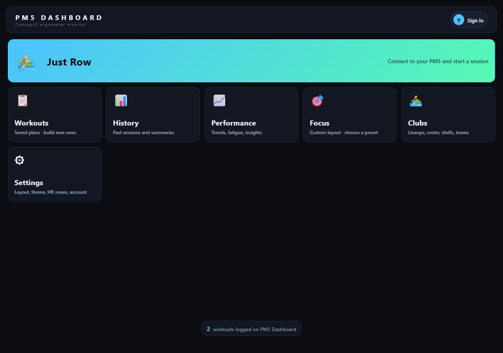
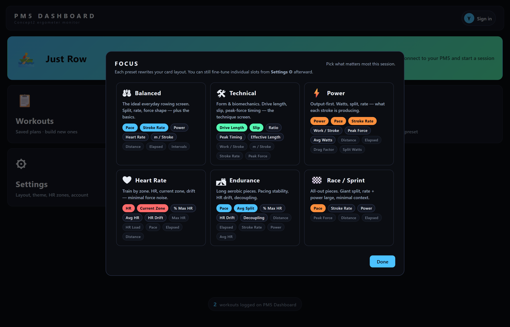
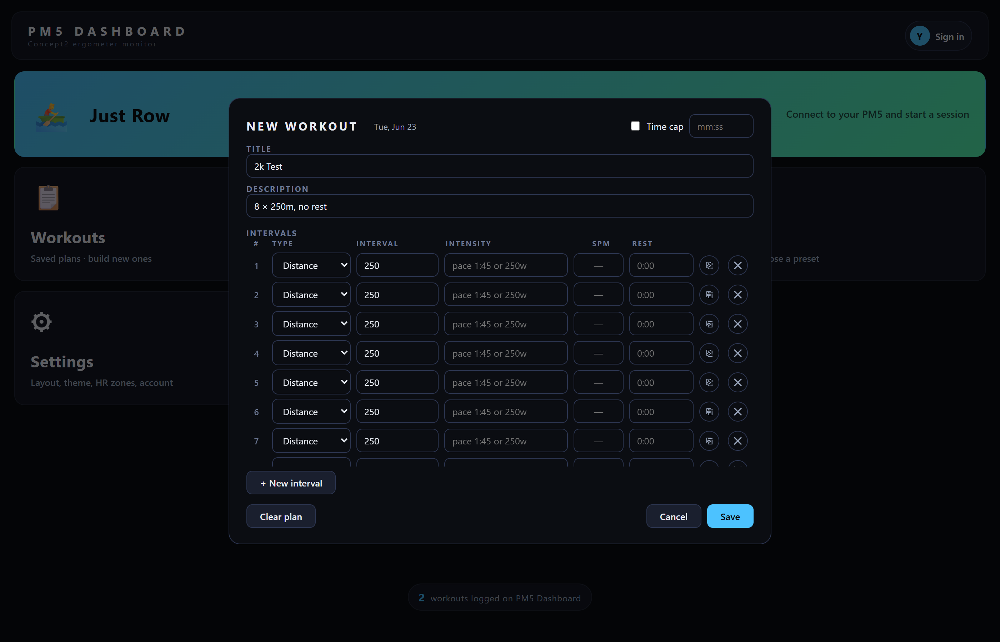
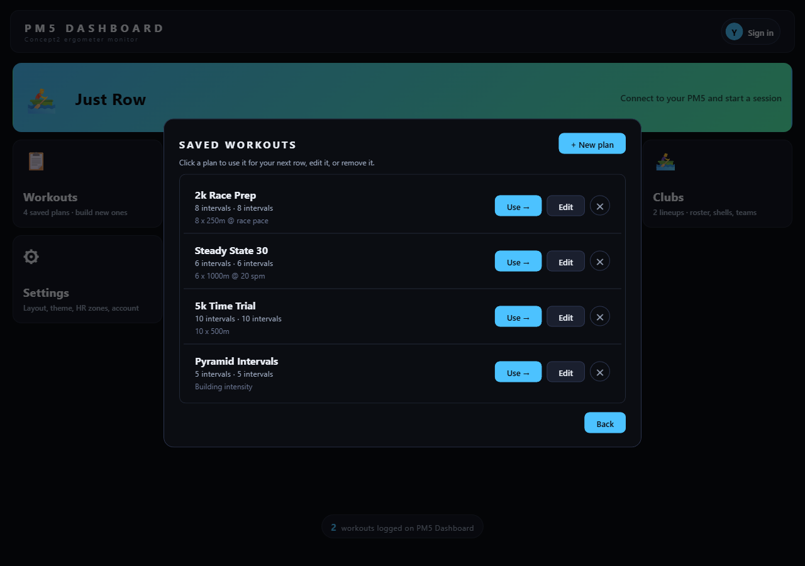
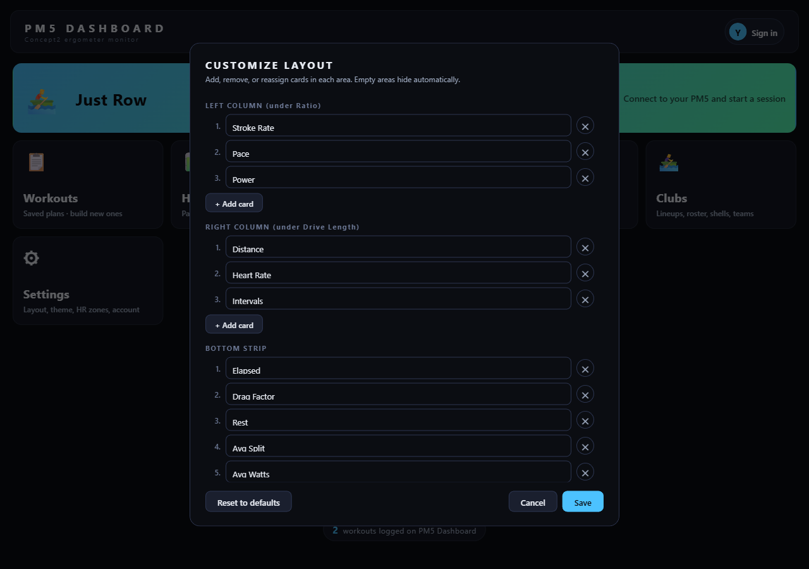
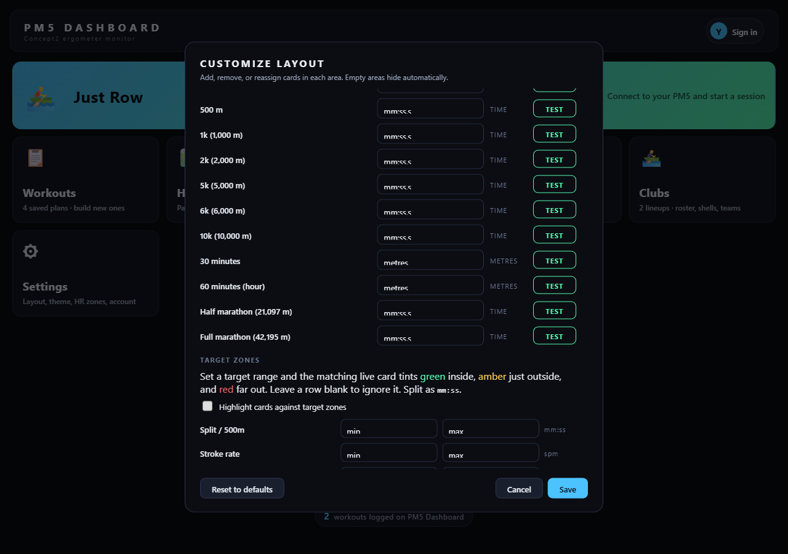

# PM5 Dashboard

A real-time training dashboard for the Concept2 PM5 rowing monitor. Built because the on-board PM5 screen leaves a lot of detail on the table — peak force timing, drive length, ratio, stroke-by-stroke force curves, HR zone drift, decoupling — and there was no free tool that put it all in one place on a device I could actually use at school.

**Live:** [pm5row.surge.sh](https://pm5row.surge.sh) · [rowerg-dashboard.surge.sh](https://rowerg-dashboard.surge.sh) · [ergdash.surge.sh](https://ergdash.surge.sh)

> Open in Chrome or Edge on a desktop or Android phone. Click **Connect**, pair the PM5 over Bluetooth, and row.

---

## What it does

| | |
|---|---|
| **Live force curve** | Reads the raw force-vs-position curve from the PM5 every stroke, draws it smoothed in real time, and overlays your **best stroke** and **session average** as ghost curves. Peak-force markers show where in the drive the peak occurs — early peak vs late peak is the most actionable technique signal you can give a rower. |
| **40+ live metrics** | Stroke rate, pace, watts, distance, peak force, avg force, work/stroke, drive length, drive ratio, slip (catch/release), peak force timing, meters/stroke, drag factor, calories, splits, and 19 HR-specific metrics (current zone, % max, % HRR, time-in-zone, drift, decoupling, recovery deltas, TRIMP load). |
| **Tier-based layouts + 6 focus presets** | Cards size themselves by importance tier (primary / secondary / passive). Six curated presets — Balanced, Technical, Power, Heart Rate, Endurance, Race — rewrite the entire screen in one tap. Race mode pins **split** as a 168px primary; Heart Rate mode swaps the force curve out for HR-zone-driven metrics. Each preset enforces **locked metrics** that can't be removed without breaking the mode. |
| **Workout builder + benchmark tests** | Build interval workouts (1 min · 500m · 1k · 2k · 5k · 6k · 10k · 30 min · 1 hour · half & full marathon). One-tap tests for the standard distances pre-fill the right interval structure (e.g. 2k → 8×250m, no rest). Plans sync across devices. |
| **PWA + Drive sync** | Installable on Android (and desktop) with an offline-capable service worker. Google Drive `appdata` scope syncs your workout history, saved plans, layout, and HR prefs across every device you sign into. |
| **Cross-user counter** | A global workout counter ticks every time anyone, anywhere, logs a session. |

---

## Screenshots

**Home menu**



**Focus preset picker — six curated modes, each with locked "defining" metrics**



**Workout builder — programmable intervals with per-row duplicate / time-cap**



**Saved workouts library**



**Settings — layout / theme / HR / force-curve overlays**



**Benchmarks — personal records, each with a one-tap test workout**



---

## Why I built it

I row. The PM5 monitor shows the basics — split, rate, distance — but the BLE port exposes way more, and the official Concept2 apps (ErgData, RowPro) either hide the advanced metrics, lock them behind paid tiers, or don't work on the device I have at school. I wanted:

- **Force curve comparisons** so I can see my best stroke ghosted behind every live one
- **Peak-force timing** as a number, not just a shape
- **HR drift / decoupling** for steady-state pacing work
- **A configurable layout** so I can show what matters today (race day vs technique day)

The first version was a Python + PySide6 desktop app (in `pm5dashboard/`). It worked but only on a computer where I could install Python. My school laptop can't run downloaded programs, only a browser — so I ported the whole thing to a single-file PWA that runs in Chrome's Web Bluetooth stack.

---

## Architecture

```
┌──────────────────────────────────────────────────────────────────┐
│                       Browser (Chrome / Edge)                    │
│                                                                  │
│  ┌────────────────┐    ┌──────────────────┐    ┌──────────────┐  │
│  │  Web Bluetooth │    │  Google Identity │    │  Service     │  │
│  │  GATT client   │    │  Services + OAuth│    │  Worker (v19)│  │
│  └───────┬────────┘    └────────┬─────────┘    └──────┬───────┘  │
│          │                      │                     │          │
│          ▼                      ▼                     ▼          │
│  ┌──────────────────────────────────────────────────────────┐    │
│  │              Single-page app (index.html)                │    │
│  │  state · BLE parser · render loop · layout engine · UI   │    │
│  └────┬─────────────────────────────┬──────────────────┬────┘    │
│       │                             │                  │         │
└───────┼─────────────────────────────┼──────────────────┼─────────┘
        │                             │                  │
        ▼                             ▼                  ▼
   Concept2 PM5                  Google Drive       Counter API
   (BLE GATT)                    (appdata folder)   (counterapi.dev)
```

### Stack

- **Frontend:** vanilla HTML / CSS / JavaScript. **No framework, no bundler, no build step.** The entire app is a single `index.html` (~240 KB) plus a manifest, service worker, and icons. This was a deliberate constraint — it makes deployment a single `npx surge` command, and the app stays installable as a PWA on any browser that implements Web Bluetooth.
- **Bluetooth:** [Web Bluetooth API](https://developer.mozilla.org/en-US/docs/Web/API/Web_Bluetooth_API). The PM5 exposes its data over BLE GATT; I subscribe to four notification characteristics, parse the raw bytes against the [Concept2 PM5 BLE Spec v1.30](docs/ble-protocol.md), and feed the values into a global state object.
- **Auth + sync:** Google Identity Services for OAuth, Google Drive `appdata` scope for hidden per-user JSON storage. No backend, no database, no server I have to maintain.
- **Hosting:** [Surge.sh](https://surge.sh) free static hosting, deployed to three mirror subdomains.
- **Offline:** A service worker (`sw.js`) does network-first for the HTML so updates land immediately, cache-first for static assets so the app loads instantly on revisit. The PWA manifest makes it installable on Android (home screen icon, splash, standalone window).

### Files

```
pm5-dashboard/
├── pm5web/                  ← The web app (deployed)
│   ├── index.html           ← Single-file app — markup, CSS, JS
│   ├── manifest.json        ← PWA manifest
│   ├── sw.js                ← Service worker (cache strategy)
│   ├── gen_icons.py         ← Generates PWA icons from a single source
│   └── icon-*.png           ← Generated PWA icons (incl. maskable variants)
│
├── pm5dashboard/            ← Original Python desktop app
│   ├── pm5dashboard.py      ← Entry point
│   ├── app/                 ← Modules (PySide6 UI, BLE client, state)
│   ├── requirements.txt     ← Python deps (PySide6, bleak, pyqtgraph, qasync)
│   ├── PM5Dashboard.spec    ← PyInstaller spec (builds a single .exe)
│   ├── build_exe.bat        ← Windows build script
│   └── run.bat              ← Dev runner
│
└── docs/
    ├── architecture.md      ← Deeper dive on system design
    └── ble-protocol.md      ← My notes on parsing the PM5's BLE protocol
```

---

## Hard problems I solved

### 1. Decoding the PM5's binary BLE protocol

The PM5 publishes data over BLE GATT characteristics, but the bytes coming out of `notifications` are raw — multi-byte integers in little-endian order, packed with no padding, and the field layout depends on which characteristic you're reading. The official spec PDF describes them, but the parser still needed careful alignment work — I had an off-by-3 bug in my first version where pace, rate, and watts were all reading their bytes from the elapsed-time field, because the General Status 1 characteristic starts with a 3-byte timestamp I'd forgotten about. See [`docs/ble-protocol.md`](docs/ble-protocol.md) for the layout I reverse-engineered.

### 2. Force curve resampling for stroke comparison

Force-curve packets from the PM5 vary in length (24–40 samples depending on stroke duration). To average strokes against each other or overlay a "best stroke" ghost, every curve needs a common x-axis. I resample each completed stroke to a fixed 64 samples using linear interpolation, then maintain two parallel buffers:

- **Best stroke** — the highest-peak stroke this session (with a 0.5 lbf hysteresis so noisy peaks don't flip-flop the ghost).
- **Running average** — Welford-style online mean update, so I don't have to keep every stroke in memory.

The renderer draws all three (live + best + avg) with peak markers, dashed-line ghosts, and a small legend.

### 3. Tier-based layout engine

Six focus presets, each declaring three tiers of importance (`primary` / `secondary` / `passive`) plus a `locked` list. The renderer maps tiers → CSS classes → font sizes. A `body.preset-X` class drives the visual identity per mode — Race mode jacks the primary value to 168 px and dims everything else; Technical mode uses thinner type and gives the force curve hero extra height; Heart Rate mode swaps the accent to red. Each preset *enforces* its locked metrics in the Settings dialog — if you try to remove them, the dropdown is disabled and a 🔒 replaces the ✕.

### 4. Per-user state isolation + Drive sync

When a user signs in with Google, every piece of state (history, saved plans, layout, prefs, force-curve overlay toggles) gets keyed by their Google user ID in `localStorage`, then syncs to a private `appdata` file in their Drive. Sign-out leaves the data on the device (so re-signing-in restores it). Sign-in on a new device pulls down the cloud copy and merges any local changes. Conflict strategy: last-write-wins on layout / prefs (those are tiny and rarely conflict), per-id merge on history and saved plans (so two devices can record different workouts and both are preserved).

### 5. Evolution from desktop to web

The Python desktop app worked, but it required Python installed locally — not an option on my school's locked-down Windows laptops. The web port had to match feature parity using only what the browser exposes:

| Python desktop | Web port |
|---|---|
| `bleak` BLE library | Web Bluetooth API |
| `pyqtgraph` for force curve | HTML canvas + quadratic Bézier smoothing |
| `qasync` for asyncio + Qt event loop | Native browser event loop + `Promise` |
| `PyInstaller` single-exe builds | PWA install via manifest + service worker |
| Direct file system writes | `localStorage` + Drive `appdata` |
| `PySide6` widgets | Vanilla HTML + CSS grid |

Same architecture, completely different runtime. The web port is now the canonical version; the Python code stays in the repo as the prototype.

---

## Tech stack

**Web (`pm5web/`)**
- Vanilla HTML / CSS / JavaScript (no framework, no bundler)
- Web Bluetooth API
- Google Identity Services + Google Drive API
- Service Worker (PWA install + offline shell)
- Surge.sh hosting (free static)

**Desktop (`pm5dashboard/`)**
- Python 3.11+
- [PySide6](https://pypi.org/project/PySide6/) (Qt for Python)
- [bleak](https://github.com/hbldh/bleak) (cross-platform BLE)
- [pyqtgraph](http://www.pyqtgraph.org/) (real-time plotting)
- [qasync](https://github.com/CabbageDevelopment/qasync) (asyncio + Qt event loop integration)
- [PyInstaller](https://www.pyinstaller.org/) (single-exe distribution)

---

## Running it

### Web (recommended)

Just open one of the live URLs in Chrome or Edge:

- https://pm5row.surge.sh
- https://rowerg-dashboard.surge.sh
- https://ergdash.surge.sh

Click **Connect**, pair your PM5, and row. On Android Chrome, tap the menu → **Install app** to add it to your home screen as a PWA.

### Desktop (Python original)

```bash
cd pm5dashboard
pip install -r requirements.txt
python pm5dashboard.py
```

Or build a single-file `.exe` with PyInstaller (Windows):

```bash
build_exe.bat
```

---

## What's next

- **Multi-coach mode** — Firebase Auth + Firestore so coaches can share lineups with their athletes (Phase 2 schema and security rules are already in the codebase, dormant behind a placeholder config).
- **Session replay** — scrub through a finished workout and watch each stroke's force curve evolve.
- **Multi-erg sync** — for winter team training: 8 ergs paired to one coach dashboard for crew synchronization analysis.

---

## Reflection

For a short writeup of what I learned, what surprised me, and what I'd do differently if I started over, see [`docs/reflection.md`](docs/reflection.md).

---

## License

[MIT](LICENSE) — do whatever you want with it.

---

*Built by Charan Bikkula. The PM5 BLE protocol reference belongs to Concept2; this is an independent project not affiliated with or endorsed by Concept2 Inc.*
